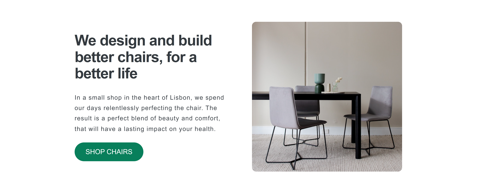
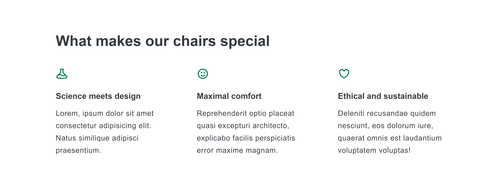
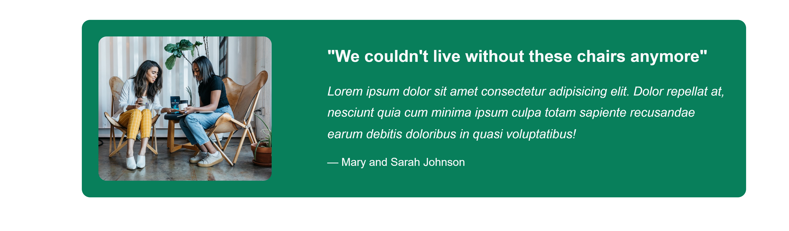
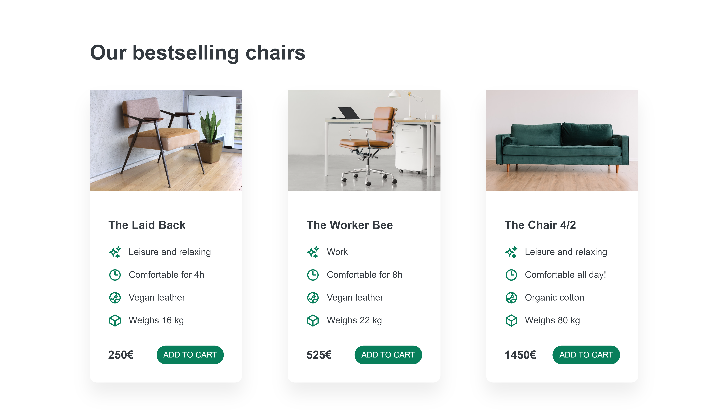

# Simple-Landing-Page

### Project Overview

This is a simple static landing page built using HTML and CSS, designed to be a part of an e-commerce website. The layout leverages CSS Grid and Flexbox for structure and alignment, ensuring a modern design. The webpage includes the following key sections:

- **Header Section**: Introduces the website with a headline and a brief description, paired with a call-to-action button.

- **Feature Section**: Highlights the main features or benefits of the products or services offered on the website.

- **Testimonial Section**: Showcases customer testimonials to build trust and credibility with potential customers.

- **Product Listing Section**: Displays a selection of products, each presented in a structured card layout.

- **Footer Section**: Provides additional navigation links or information at the bottom of the page.

### Technology Used

- **HTML** : Provide Foundational structure of webpage
- **CSS** : Style the component and enhance its visual appearance
- **CSS Flexbox** : Align and distributing space among items within a container.
- **CSS Grid** : Create the main layout structure,
- **Basic Design Principles** : Implemented to ensure the page is visually appealing, including considerations for typography, color theory, spacing, and overall user experience.

### Project Screenshot

#### Header Section



#### Feature Section



#### Testimonial Section



#### Product List



#### Footer Section


### Demo

You can view this project by clicking on this [Demo LInk](https://enigm413.github.io/Simple-Landing-Page/)

### Usage

- Clone the repository to your local machine:
  ```bash
  git clone https://github.com/enigm413/Simple-Landing-Page.git
  ```
- Navigate to the project directory:
  ```bash
  cd Simple-Landing-Page
  ```
- Open index.html in your preferred web browser to view the page.

You can edit the HTML or CSS files to customize the content and appearance as needed.

### Contributing

If you want to contribute:

1. Fork the repository.
2. Create a new branch for your changes.
3. Commit your changes and push the branch.
4. Submit a pull request.
5. Please keep the HTML structure clean and maintain semantic markup.

### License

This project is licensed under the MIT License. See the [LICENSE](./LICENSE) file for more details.
